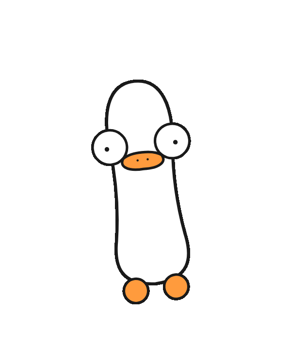

# StayUp

> Duck's up, all night baby.

[](./LICENSE)
[](./LICENSE)
[](https://www.apple.com/macos/)
[](https://en.wikipedia.org/wiki/Apple_silicon)
[](https://swift.org)

Free Apple Silicon Mac menu-bar Duck that keeps your Mac awake when macOS
really wants a nap.

Close lid. LLM still running. Render still rendering. Download still
downloading.

Duck up.

Set up the Helper. That is not a side quest. That is the point.

<p align="center">
  
</p>

## What The Duck Does It Do

- **Off / On / Auto.** Off: sleep, fine. On: Duck up now. Auto: Duck up while
  selected Activity Sources prove local work.
- **Lid-closed work.** Battery plus lid closed is the hard case. Helper handles it.
- **MacBook as Mac mini.** Dock it, close it, run Ollama, a worker, a tiny server,
  or the overnight thing that should not die.
- **Screen lock, your call.** Screen can stay awake. Screen can sleep. System
  stays awake for background work.
- **Don't Die.** Cuts Duck off before the Mac faceplants. BJ help.
  Bryan Johnson obviously.
- **Walking Duck.** Macs with an Apple SPU accelerometer get a tiny judgemental
  walk cycle.
- **Good Duck.** No telemetry. No accounts. Just a Duck.

## Normies Way

Download the DMG from [getstayup.app](https://getstayup.app). Drag StayUp to
Applications. Open Duck.

During first setup, do the prompts. Duck knows. Annoying, yes. Important, yes.

- **Welcome window:** Launch at Login, Helper setup, and update preference.
- **Helper setup:** macOS approval plus one password prompt. This is the
  lid-closed-on-battery part. Without it, hard case not covered.
- **Sparkle update prompt:** optional. It may appear on a later launch unless
  you already chose in Welcome or Settings. If enabled, Sparkle checks
  `getstayup.app/appcast.xml` for signed updates.

## Respectable Way

StayUp is a small AppKit app built with `swiftc`. No Xcode project. No SPM.
Sparkle is vendored so a fresh clone can build without dependency setup.

```bash
cd StayUp
bash build.sh

cp -R StayUp.app /Applications/
open /Applications/StayUp.app
```

For the real StayUp setup:

```text
StayUp menu -> Settings -> Helper -> Set up
```

No Helper, no hard-case promise. Duck is bold, not fake.

For a notarized local build:

```bash
bash build.sh notarize
```

That needs a Developer ID certificate and a configured `notarytool` keychain profile.

## Auto Mode

Auto mode is Duck with timing. Work starts, Duck up. Work stops, grace timer,
Duck down.

StayUp watches:

```text
~/.stayup/
├── sources/
│   ├── reported-cli/
│   │   ├── source.json
│   │   └── active/
│   ├── local-runner/
│   │   ├── source.json
│   │   └── active/
│   └── ollama/
│       ├── source.json
│       └── active/
└── status.json
```

Reported CLIs write direct heartbeat files under their own
`sources/<tool>/active/` folders. Other local tools can be observed by adding an
`sources/<tool>/source.json`, or by writing the same heartbeat contract directly.

The rule is simple: local work must prove it is working. Thinking, running shell
commands, searching files, building, testing, generating, downloading. Real work
gets `active`. Fake work gets nothing.

The contract is documented in [docs/activity-source-contract.md](./docs/activity-source-contract.md).
Activity Source examples and a copy prompt are in
[docs/activity-sources.md](./docs/activity-sources.md).

Important limits:

- Cloud/web work runs somewhere else. It does not keep this Mac awake unless a
  local thing writes a heartbeat.
- Waiting on a human does not keep the Mac awake forever. Grace timer, Duck down.
- Manual mode and Off commands win. Auto only drives while Auto is selected.

## How It Works

In default keep-screen-on mode, StayUp can use these layers:

| # | Layer | Trick | File |
|---|---|---|---|
| 1 | `Caffeinate` | `caffeinate -dis -w $PID`, or `-is` when the screen may sleep | `Sources/Caffeinate.swift` |
| 2 | `SleepPreventer` | IOKit idle/system assertions, display assertion only when keeping the screen on, plus ProcessInfo activity | `Sources/SleepPreventer.swift` |
| 3 | `ClosedLidPreventer` | IOKit system-sleep assertion | `Sources/ClosedLidPreventer.swift` |
| 4 | `VirtualDisplay` | Private `CGVirtualDisplay` fake external display when keeping the screen on and no real external display is connected | `Sources/VirtualDisplay.swift` |
| 5 | `StayUpHelper` | Root LaunchDaemon + `pmset disablesleep` | `Sources/StayUpHelper.swift` + `Helper/main.swift` |

Battery plus lid closed on Apple Silicon depends on layer 5. The virtual display
helps in other display/sleep paths. The Helper is the required layer for the
hard case.

If **Keep screen on** is off, display-sleep layers are intentionally skipped so
macOS can lock or sleep the display while system-sleep protection stays active.

Direct distribution only. The App Store sandbox is not the pond for this Duck:
the private display API and the root helper are central to the app.

## Privacy

No telemetry. No accounts. Just a Duck.

- No telemetry.
- No analytics.
- No crash reporting.
- No accounts.
- Sparkle update checks happen only if enabled or manually requested.
- Feed Duck opens `getstayup.app/tip` in the browser when clicked.
- Accelerometer samples stay local, run only while engaged, and are discarded.
- Auto mode reads local Activity Source receipts and optional local session
  details for the menu. Those Auto-mode reads do not leave the Mac.

Security notes live in [SECURITY.md](./SECURITY.md).

## Resource Use

Approximate local measurements for the current v1.0 build. Tiny CPU. Normal
Cocoa menu-bar RAM tax.

| State | CPU | RAM |
|---|---:|---:|
| Idle | ~0.1% | ~37 MB |
| Protecting | ~0.1% | ~37 MB |
| Walking | 1-3% bursts | ~37 MB |

Duck is not the hot part of the laptop.

## Uninstall

Polite path. Good Duck:

1. Open StayUp -> Settings -> Helper -> Uninstall Helper.
2. Quit StayUp.
3. Drag `/Applications/StayUp.app` to the Trash.

Fast path. Still works:

```bash
pkill -x StayUp
sudo launchctl bootout system/app.getstayup.helper 2>/dev/null || true
rm -rf /Applications/StayUp.app
defaults delete app.getstayup 2>/dev/null || true
```

If System Settings still shows a background item afterward, remove it from:

```text
System Settings -> General -> Login Items & Extensions
```

## Credits

- [BetterDummy](https://github.com/waydabber/BetterDummy) by Istvan T.
- [apple-silicon-accelerometer](https://github.com/olvvier/apple-silicon-accelerometer) by Olivier Bourbonnais
- [OxWearables stepcount](https://github.com/OxWearables/stepcount)
- [Sparkle](https://sparkle-project.org/) for signed updates
- `/usr/bin/caffeinate`, Apple's built-in sleep-prevention tool

## Contributing

Issues and PRs welcome. No telemetry, no accounts, no Duck impersonation.

The code is MIT. Forks should use their own name and artwork so this Duck keeps
his pond.

## License

MIT. See [LICENSE](./LICENSE).
