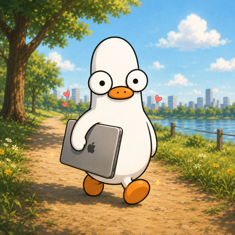
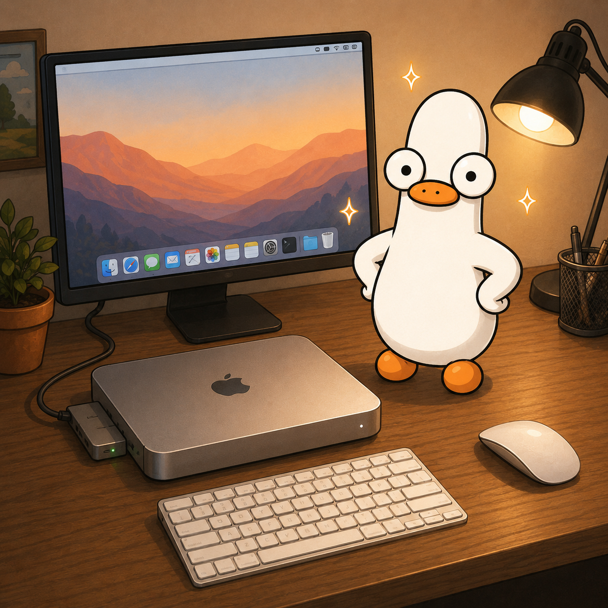
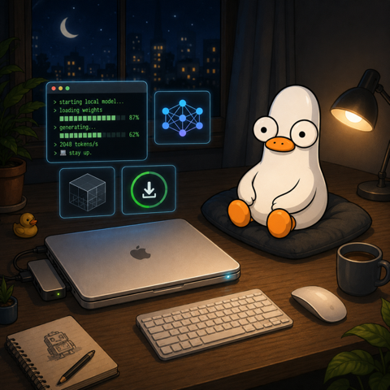

# StayUp 🦆

> Duck's up. Mac stays awake. Work does not faceplant.

[](./LICENSE)
[](./LICENSE)
[](https://www.apple.com/macos/)
[](https://en.wikipedia.org/wiki/Apple_silicon)
[](https://swift.org)
[](https://getstayup.app)

Free Apple Silicon Mac menu-bar Duck that keeps local AI agents, renders, and
downloads alive when macOS really wants a nap. No account. No telemetry. No
weird cloud leash.

Close the lid. Local AI agents, model servers, renders, and downloads can keep
working. Good Duck.

<table>
  <tr>
    <td width="33%" align="center">
      
      <br>
      <sub>Close Lid. Walk.</sub>
    </td>
    <td width="33%" align="center">
      
      <br>
      <sub>Mac(Book) Mini.</sub>
    </td>
    <td width="33%" align="center">
      
      <br>
      <sub>Ducking Auto.</sub>
    </td>
  </tr>
</table>

## 🦆 What The Duck Does

- **Don't Let Work Die.** Close the lid. Duck keeps the Mac up.
- **Ducking Auto.** Trusted local work starts. Duck wakes. Work stops. Duck naps.
- **Walks With You.** Carry the Mac. Duck waddles. Important science.
- **Don't Die.** Low battery? Duck taps out before the Mac faceplants.

<p align="center">
  
</p>

## 🤔 Why Not Amphetamine?

Amphetamine is excellent and packed. If you want the big cockpit, use it.

StayUp is the tiny weird Duck for local AI/tool work. Activity Source receipts
prove the job is alive, Auto keeps the Mac awake, then Duck stands down when
the receipts go quiet. It is built for the awkward moment where a long local AI
run, model server job, render, or download is still working but the lid needs to
close.

If there is no real external monitor, Duck can also make a small fake display
for remote GUI tools. The hard battery + lid-closed promise comes from the
Helper path, not from pretending a display is magic.

My creator hatched a Duck before Googling hard enough. Duck has learned
humility. Duck remains up.

## 🧠 Built For Local Agent Runs

Most keep-awake tools answer "stay on until I remember to turn it off."
StayUp's Auto mode answers a narrower question: "is trusted local work still
alive?"

That matters for agent sessions. Local AI tools can run for a long time, go
quiet between steps, or finish while you are away. StayUp watches local, opt-in
Activity Sources so the Mac can stay awake while work is real, then release
after the grace period.

## 🚀 Getting A Duck

### Normies Way ✨

Download StayUp from [getstayup.app](https://getstayup.app).

First setup has a few macOS prompts:

- **Welcome window:** Launch at Login, Helper setup, update preference.
- **Helper setup:** macOS approval plus one password prompt. This is the
  lid-closed-on-battery part.
- **Sparkle updates:** optional signed automatic updates. Turn them on and Duck
  checks once right away; manual Check Now is always there.

No Helper, no hard-case promise. Duck is bold, not fake.

### Respectable Way 🛠

StayUp is a small AppKit app built with `swiftc`. No Xcode project. No SPM.
Sparkle is vendored so a fresh clone can build without dependency setup.

```bash
git clone https://github.com/NongKnot/StayUp.git
cd StayUp
bash build.sh

cp -R StayUp.app /Applications/
open /Applications/StayUp.app
```

For the real StayUp setup:

```text
StayUp menu -> Settings -> Helper -> Set up
```

## ⚡ Auto Mode

Auto mode is Duck with timing:

```text
work starts -> Duck up
work stops  -> grace timer
quiet again -> Duck down
```

Starter sources: Claude, Codex, Cursor, LM Studio, and Ollama. Sources are
local and opt-in. Cloud/web work somewhere else does not keep this Mac awake
unless a local thing writes a heartbeat.

## 🔒 Privacy

No telemetry. No analytics. No crash reporting. No accounts.

StayUp reads local Activity Source receipts, optional local session details for
the menu, and accelerometer samples only while engaged. Sparkle checks for
updates only if enabled or manually requested.

Security notes live in [SECURITY.md](./SECURITY.md).

## 🧹 Uninstall

Polite path. Good Duck:

1. Open StayUp -> Settings -> Helper -> Uninstall Helper.
2. Quit StayUp.
3. Drag `/Applications/StayUp.app` to the Trash.

Fast path:

```bash
pkill -x StayUp
sudo launchctl bootout system/app.getstayup.helper 2>/dev/null || true
rm -rf /Applications/StayUp.app
defaults delete app.getstayup 2>/dev/null || true
```

If System Settings still shows a background item afterward, remove it from:

```text
System Settings -> General -> Login Items & Extensions
```

## 🙏 Credits

- [BetterDummy](https://github.com/waydabber/BetterDummy) by Istvan T.
- [apple-silicon-accelerometer](https://github.com/olvvier/apple-silicon-accelerometer) by Olivier Bourbonnais
- [OxWearables stepcount](https://github.com/OxWearables/stepcount)
- [Sparkle](https://sparkle-project.org/) for signed updates
- `/usr/bin/caffeinate`, Apple's built-in sleep-prevention tool

The code is MIT. Forks should use their own name and artwork so this Duck keeps
his pond.

## 📜 License

MIT. See [LICENSE](./LICENSE).
